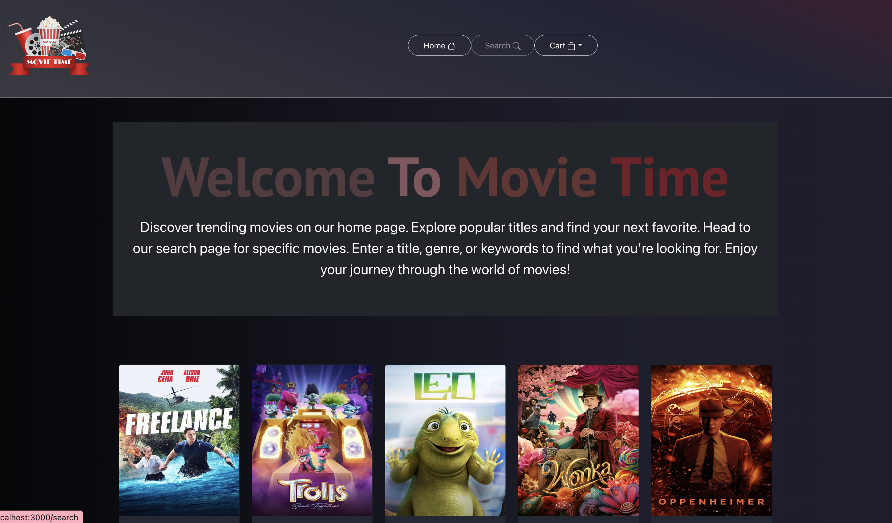
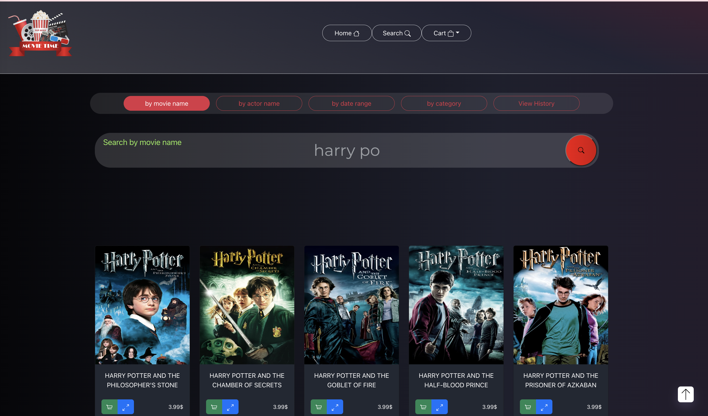
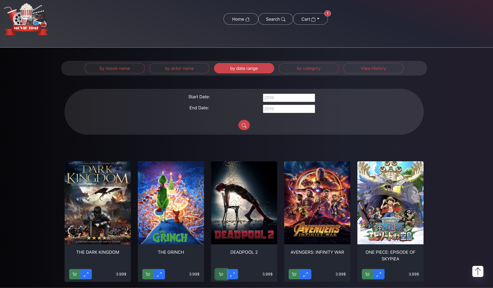
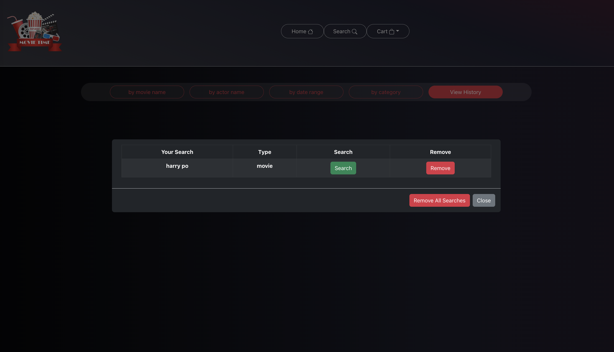
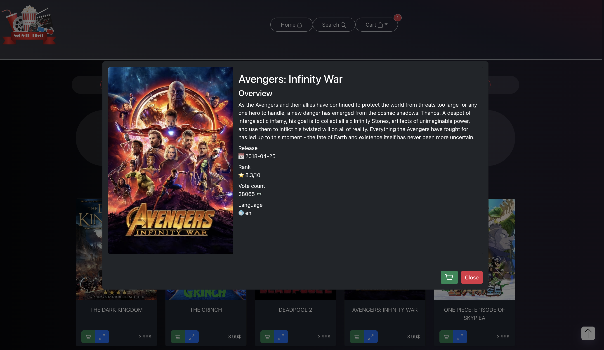
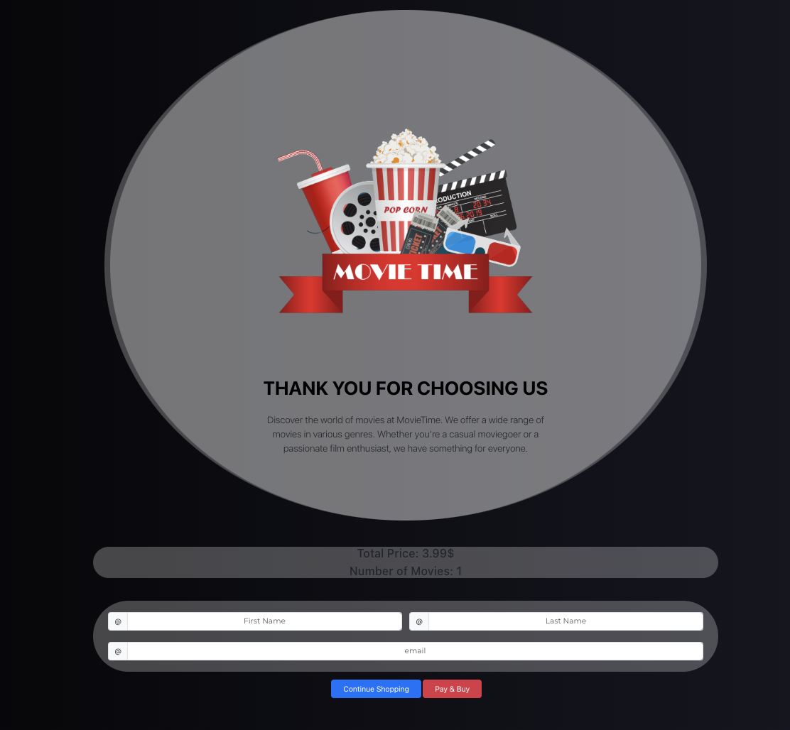

# Movie-Time 

## Table of Contents

- [Overview](#Overview)
- [Installation](#installation)
- [Setup](#setup)
- [Features](#features)
- [Technologies Used](#technologies-used)
- [Acknowledgements](#acknowledgements)
- [Configuration](#configuration)
- [Authors](#authors)

## Overview
Movie-Time is a sophisticated web application aimed at enhancing your movie exploration experience. Offering an array of advanced features and an intuitive user interface, Movie-Time enables users to discover trending movies, explore popular titles, and search for specific movies based on various criteria. Whether you're a seasoned movie enthusiast or seeking your next favorite film, Movie-Time is tailored to meet your needs.

| Home Screen | Search by Actor | Search by Dates |
|-------------|-----------------|-----------------|
|  |  |  |

| Search History | Movie Data Card | Checkout |
|----------------|-----------------|----------|
|  |  |  |


## Installation

1. **Clone the repository:**
      ```bash
      git clone https://github.com/noammirjani/TMDB-store.git
      ```

2. **Client-side Setup (React)**:

   - Navigate to the `client` directory:
      ```bash
      cd client
      npm install
      ```

   - Install dependencies:
       ```bash
       npm install dotenv --save
       ```

   - Obtain a new API key from [TMDB API](https://www.themoviedb.org/documentation/api) by signing up or logging in.

   - Create an environment variable file:
      - Create a file named `.env` in the root directory of the React project (alongside `package.json`).
      - Add your environment variable using the `REACT_APP_API_KEY=your_api_key_here` format.
      - Replace `your_api_key_here` with the obtained API key.
      - Save the file.

   - Start the React development server:
       ```bash
       npm start
       ```
   - The client runs on: http://localhost:3000

3. **Server-side Setup (Spring Boot)**:

   - Ensure MAMP or a similar database server is running.
   - Access phpMyAdmin from MAMP and create a database named "ex4".
   - Update `src/main/resources/application.properties`:
      - For Mac:
          ```properties
          spring.datasource.username=root
          spring.datasource.password=root
          ```
      - For Windows:
          ```properties
          spring.datasource.username=root
          spring.datasource.password=
          ```

   - Run the Spring Boot server:
      - Execute the file `src/main/java/hac/DemoApplication.java` to start the server.
      - The server runs on: http://localhost:8080/api

   **Project Initialization Steps:**
   - Open the project and follow IntelliJ's prompts to "Load Maven Project".
   - Ensure the Java SDK is properly configured.

## Features

### Captivating Home Page
The immersive home page of Movie-Time showcases a carefully curated selection of popular movies, providing users with instant access to trending and highly-rated films. The visually appealing layout and intuitive design offer an enjoyable and engaging browsing experience.

### Comprehensive Movie Exploration
Movie-Time offers an extensive collection of movies, each accompanied by detailed information and engaging visuals. From movie posters to release dates and pricing information, users have access to all necessary details to make informed choices.

### Diverse Search Options
Empowering users with multiple search criteria, Movie-Time includes advanced search functionalities:

- **Search by Genres**: Find movies matching preferred genres like action, comedy, drama, and more.
- **Search by Movie Name**: Discover movies based on titles or related keywords.
- **Search by Actor Name**: Explore movies featuring specific actors.
- **Search by Year Range**: Delve into movies released within a specific range of years.

### Seamless Navigation
Efficiently navigate through search results with Movie-Time's support for paginated results and infinite scroll. Explore multiple pages of movies seamlessly and effortlessly with the infinite scroll functionality.

### Personalized Experience
Value-driven features such as search history and user registration enhance the personalized experience. Recorded search queries enable revisiting previous searches, providing a clutter-free and tailored exploration experience.

### Secure User Authentication
Offering user registration functionality, Movie-Time ensures a secure and seamless user experience with session management for user authentication.

## Technologies Used

- **Front-end**: React, React Bootstrap, HTML, CSS
- **Back-end**: Spring Boot, Java, MySQL (JPA repository for SQL database)
- **API Integration**: TMDB API for movie data

## Acknowledgements

- Movie data provided by [TMDB API](https://developer.themoviedb.org/docs)
- React Bootstrap for UI components
- Spring Boot for backend development

## Configuration

- **Movie API**: Replace the placeholder API key in the `useApi` hook with your own API key.

## Authors
- **Noam Mirjani**
- **Ariel Amon**